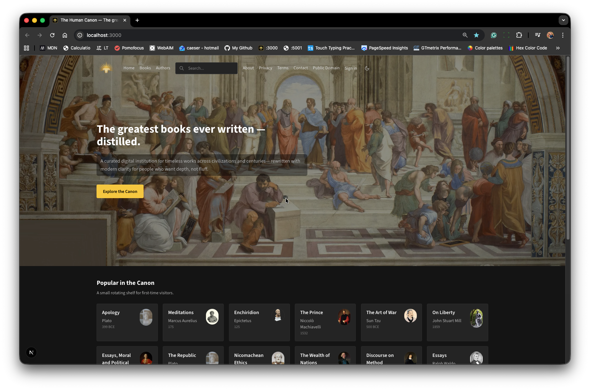
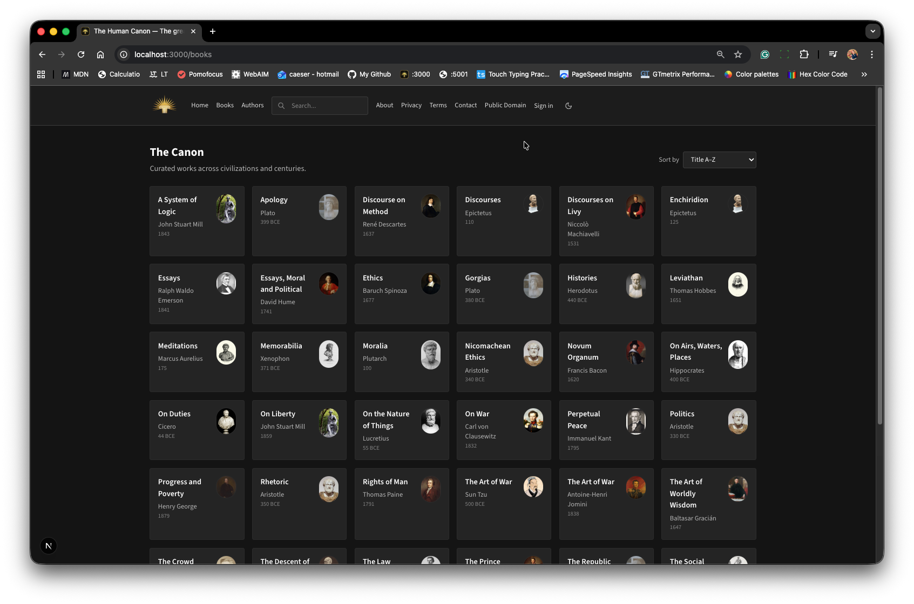
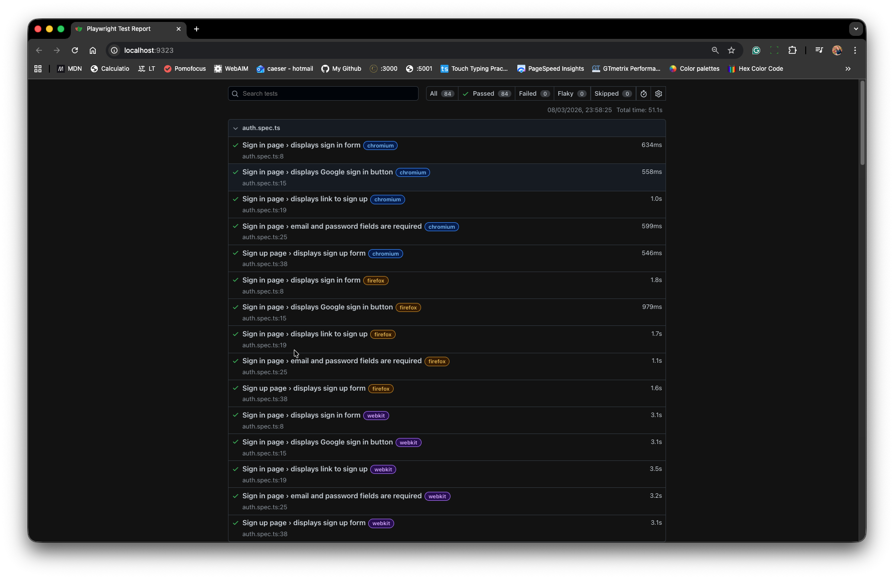
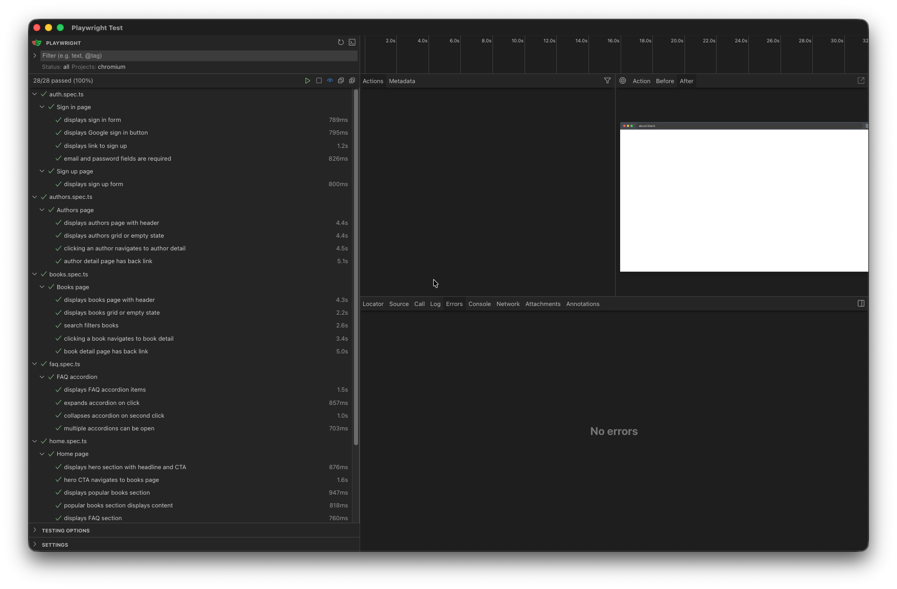

# The Human Canon

> The greatest books ever written — distilled for modern life.

**Live:** [the-human-canon.vercel.app](https://the-human-canon.vercel.app/)

<p align="center">
  
  
</p>

The Human Canon is a content-first digital library for timeless books, authors, and ideas. It is built with a modern React and Next.js stack, backed by Supabase, and designed for durability: strong typing, accessible UI, SEO-aware architecture, a maintainable codebase, and comprehensive end-to-end testing with Playwright.

---

## Overview

The project delivers a curated library of influential works through a modern web application focused on:

- clear content architecture
- strong type safety
- accessible, semantic interfaces
- static-first performance
- maintainable data and content pipelines
- production-ready deployment on Vercel

Books and authors are modeled as structured content, allowing the app to generate browse pages, detail pages, metadata, sitemap entries, and related content from a consistent source of truth.

---

## Core Capabilities

- **Canon library** with rich book pages, summaries, key ideas, quotes, and relevance
- **Author profiles** with biographies, context, and related works
- **Authenticated book actions** including favorites, read status, and wishlist
- **Dynamic metadata and sitemap generation** for SEO
- **Dark and light themes** using CSS variables and a token-driven design system
- **Responsive layouts** for mobile, tablet, and desktop
- **End-to-end testing** across Chromium, Firefox, and WebKit
- **Seeded content pipeline** for repeatable data population in Supabase

---

## Technology Stack

### Frontend

- **Next.js 15** with the App Router
- **React 19**
- **TypeScript 5**
- **Tailwind CSS**
- **Lucide React**

### Backend and Data

- **Supabase PostgreSQL**
- **Supabase Auth**
- **Supabase JS v2**

### Tooling

- **Playwright** for E2E testing
- **ESLint**
- **tsx** for seed scripts
- **Vercel** for deployment

---

## Architecture

### 1. Static-first rendering

Book and author pages are generated ahead of time wherever possible.  
This keeps public content fast, indexable, and deployment-friendly, while still allowing authenticated user state to be layered in where required.

### 2. Structured content model

Books and authors are stored as structured records rather than raw CMS blobs.  
This makes it possible to reuse the same content across:

- page rendering
- metadata generation
- related content sections
- sitemap generation
- internal linking

### 3. Supabase as the content and auth layer

The application uses Supabase for:

- canon content storage
- authentication
- user-specific book actions
- row-level security

Public canon content is readable via safe public access rules, while user actions are protected through RLS policies scoped to the authenticated user.

### 4. Seed-driven workflow

A seed script populates the canon data into Supabase using idempotent upserts.  
This keeps the content pipeline reproducible and avoids manual database editing.

---

## Key Features

- **Content-first design**: Rich book summaries, key ideas, notable quotes, and “why it matters today” sections. Author bios with early life, philosophy, legacy.
- **SEO**: Per-page metadata (`generateMetadata`), dynamic sitemap, semantic HTML, Open Graph tags.
- **Accessibility**: WAI-ARIA accordions, keyboard navigation, theme-aware contrast.
- **Theming**: Dark (default, IMDb-inspired) and light (Flexoki-inspired warm paper) via CSS variables and `data-theme`.
- **Responsive**: Mobile-first grid layouts, fluid typography, touch-friendly targets.
- **Type safety**: Shared `CanonBook` and `CanonAuthor` types across seed data, lib, and components.

---

|                                                 |                                              |
| :---------------------------------------------: | :------------------------------------------: |
|  |  |

## E2E Testing (Playwright)

Production-quality end-to-end tests cover home, books, authors, navigation, FAQ, and auth flows.

```bash
# Install browsers (first time only)
npx playwright install

# Run all E2E tests (builds app, starts server, runs tests)
npm run test:e2e

# Run with UI mode for debugging
npm run test:e2e:ui

# Run in headed mode (see browser)
npm run test:e2e:headed
```

Tests run against Chromium, Firefox, and WebKit by default. Use `--project=chromium` to run only Chromium for faster feedback.

---

## Getting Started

### Prerequisites

- Node.js 20+
- npm or pnpm
- Supabase account

## Deployment

Optimized for **Vercel**:

- Static pages pre-rendered at build
- Edge-ready for API routes if added
- Automatic preview deployments from `main`

---

## License

Private. All rights reserved.
